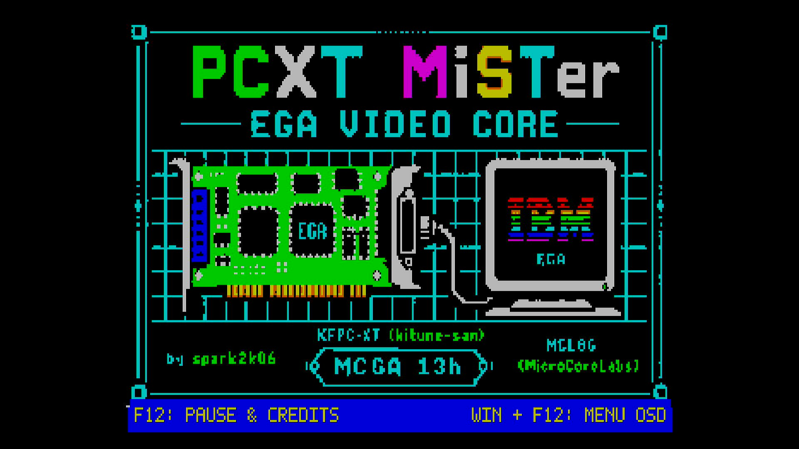

# [IBM PC/XT](https://en.wikipedia.org/wiki/IBM_Personal_Computer_XT) for [MiSTer FPGA](https://mister-devel.github.io/MkDocs_MiSTer/)

PCXT port for MiSTer by [@spark2k06](https://github.com/spark2k06/).

Discussion and development of the core take place in the
[MiSTerFPGA PCXT forum section](https://misterfpga.org/viewforum.php?f=40).

## Description

The goal of this core is to provide a reliable IBM PC/XT-compatible machine for MiSTer. It builds on the [MCL86 core](https://github.com/MicroCoreLabs/Projects/tree/master/MCL86) from [@MicroCoreLabs](https://github.com/MicroCoreLabs/) and [KFPC-XT](https://github.com/kitune-san/KFPC-XT) from [@kitune-san](https://github.com/kitune-san).

The project also acknowledges [Graphics Gremlin](https://github.com/schlae/graphics-gremlin) from TubeTimeUS ([@schlae](https://github.com/schlae)).

[JTOPL](https://github.com/jotego/jtopl) by Jose Tejada ([@jotego](https://github.com/jotego)) provides AdLib sound.

## Key features

* 8088 CPU speed settings: 4.77 MHz, 7.16 MHz, 9.54 MHz, and PC/AT 3.5 MHz equivalent (maximum speed)
* IBM PC/XT 5160 and compatible systems with an EGA-centered video path
* CGA-compatible text and graphics behavior implemented through EGA
* Optional MCGA mode 13h (320x200x256), controlled from the OSD and disabled by default
* 640 KiB conventional memory plus 384 KiB UMB
* EGA BIOS option ROM support
* EMS memory up to 2 MiB
* XTIDE support
* Audio: AdLib, C/MS and PC speaker
* Joystick support and serial mouse on COM1 (for example, with CTMOUSE 1.9 in `hdd/`)
* Second SD card support
* EGA graphical boot splash, configurable from the OSD

## Current configuration

EGA is the active video hardware model. CGA-compatible software behavior is
handled by the EGA path rather than by a separate CGA adapter. Standalone CGA,
HGC, Tandy video, Tandy audio and Tandy keyboard variants are not active
hardware-selection paths in this configuration.

* System/ROM set to PC/XT
* EGA video active at boot
* CGA-compatible text and graphics behavior through EGA
* Optional MCGA mode 13h, enabled only from the OSD
* OPL2 enabled for common DOS FM audio
* CMS enabled
* EMS enabled for expanded memory

## Quick Start

* Copy the contents of `games/PCXT` to your MiSTer SD card and extract `hd_image.zip`. It contains a [FreeDOS](https://www.freedos.org/) image.
* Select the core from Computers/PCXT.
* Press Win + F12 on your keyboard.
  * Model: IBM PCXT.
  * CPU Speed: PC/AT 3.5MHz (Max speed)
  * FDD & HDD -> HDD Image: FreeDOS_HD.img
  * BIOS -> PCXT BIOS: choose a compatible system BIOS, such as `bios-micro8088-xtide.rom` from `SW/8088_bios/binaries/`.
* Choose Reset & apply settings.

## ROM Instructions

ROMs are loaded from the **System & BIOS** section of the OSD. It provides slots for the main system BIOS, an optional XTIDE ROM at `EC00h`, and the EGA BIOS. Once loaded, a ROM remains available on subsequent boots until it is replaced. Original and copyrighted system ROMs can be prepared with the Python scripts in `SW/ROMs/`:

* `SW/ROMs/make_rom_with_ibm5160.py`: creates `pcxt.rom` from the original IBM 5160 ROM. It requires an XTIDE BIOS at `EC00h` to use hard-disk images.
* `SW/ROMs/make_rom_with_jukost.py`: creates `pcxt.rom` from the Juko ST ROM with the XTIDE BIOS embedded at `F000h`.

The same OSD section accepts an XTIDE ROM of up to 16 KiB at `EC00h`; one is included in this repository.

Other Open Source ROMs are available in the same folder:

* `pcxt_pcxt31.rom`: includes the XTIDE BIOS at `F000h`. ([source code](https://github.com/virtualxt/pcxtbios))
* `bios-micro8088-xtide.rom`: Micro8088 BIOS with XTIDE support, built from the [8088 BIOS source code](https://github.com/skiselev/8088_bios).
* `ide_xtl.rom`: XTIDE BIOS used by some scripts and upgradeable from its [upstream project](https://www.xtideuniversalbios.org/).

## Other BIOSes

* https://github.com/640-KB/GLaBIOS

## Mounting the FDD image

The floppy disk image size must be compatible with the BIOS, for example:

* On IBM 5160 only 360 KiB images work well.
* On Micro8088 only 720 KiB and 1.44 MiB images work properly.
* Other BIOS may not be compatible, such as OpenXT by Ja'akov Miles and Jon Petroski.

It is possible to use images smaller than the size supported by the BIOS, but only pre-formatted images, as it will not be possible to format them from MS-DOS.

## Developers

Please send contributions and pull requests to the prerelease branch. They are reviewed periodically and merged into the main branch as part of releases.

Thank you!
