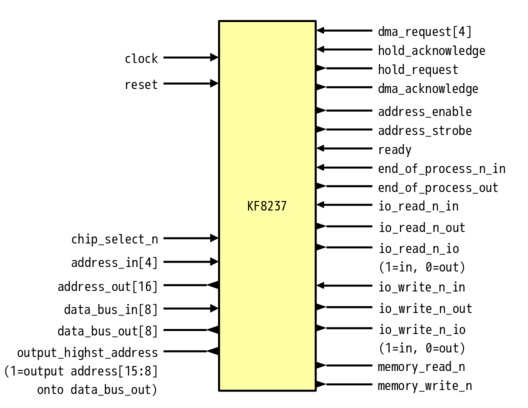

# KF8237 - 8237/8237A-like programmable DMA controller written in SystemVerilog 

## About
KF8237 is programmable DMA controller like 8237/8237A.

## Differences from original
- AEN timing
- Memory-to-Memory transfer is not supported (TODO)
- I/O ports is separated into input and output port

## Features
- Single transfer mode
- Block transfer mode
- Demand transfer mode
- Cascade mode
- 3 Transfer types (Read/Write/Verify)
- Autoinitialize
- Rotating priority
- Compressed timing

## Block

