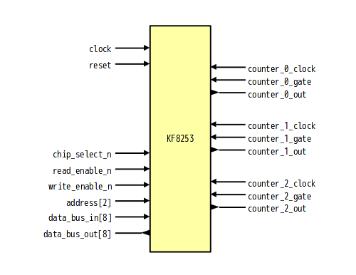

# KF8253 - 8253-like programmable interval timer written in SystemVerilog

## About
KF8253 is programmable interval timer like 8253.

## Differences from original
- Clock synchronization
- I/O ports is separated into input and output port

## Features
- 3 counters
- Count Binary or BCD
- Mode 0: Interrupt on Terminal Count
- Mode 1: Programmable One-Shot
- Mode 2: Rate Generator
- Mode 3: Square Wave Rate Generator
- Mode 4: Software Triggered Strobe
- Mode 5: Hardware Triggered Strobe

## Block

