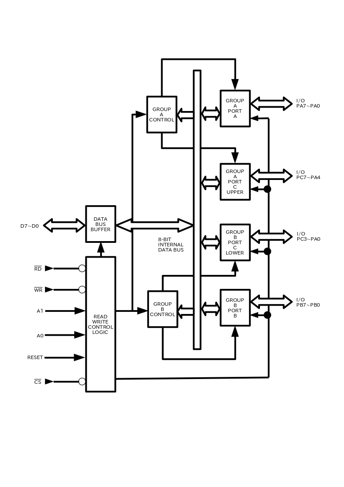
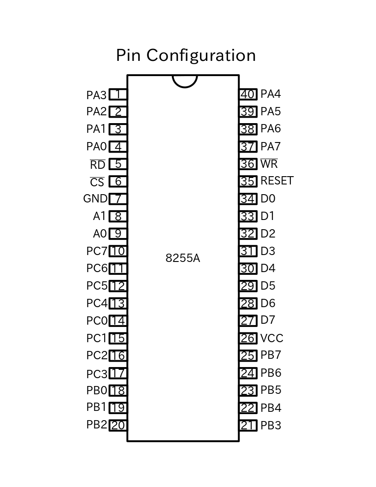
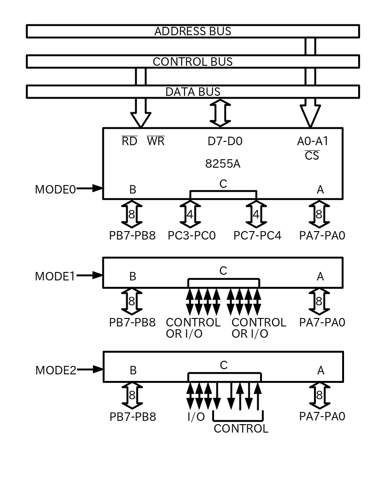
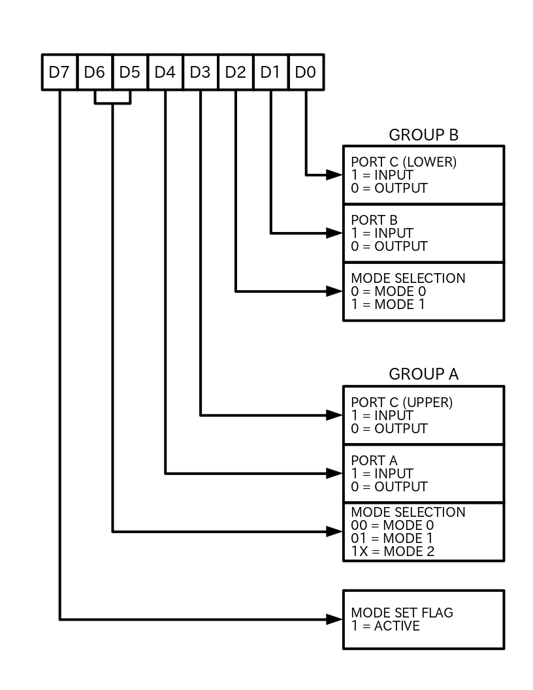
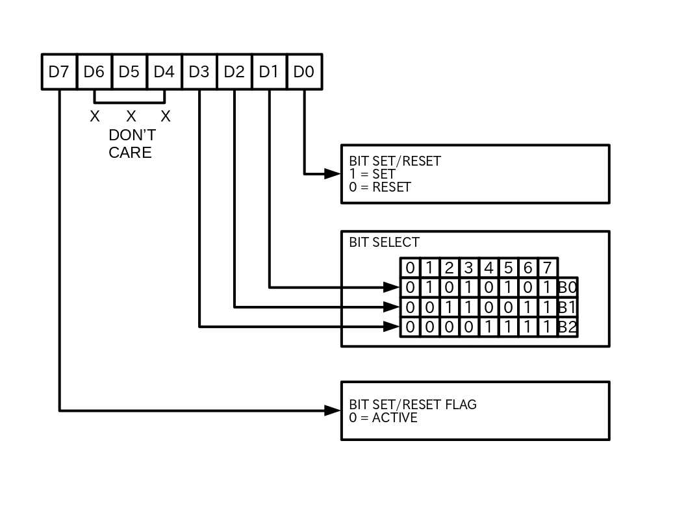
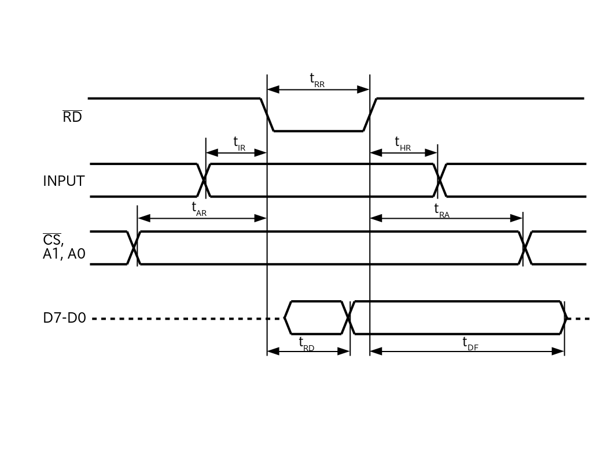
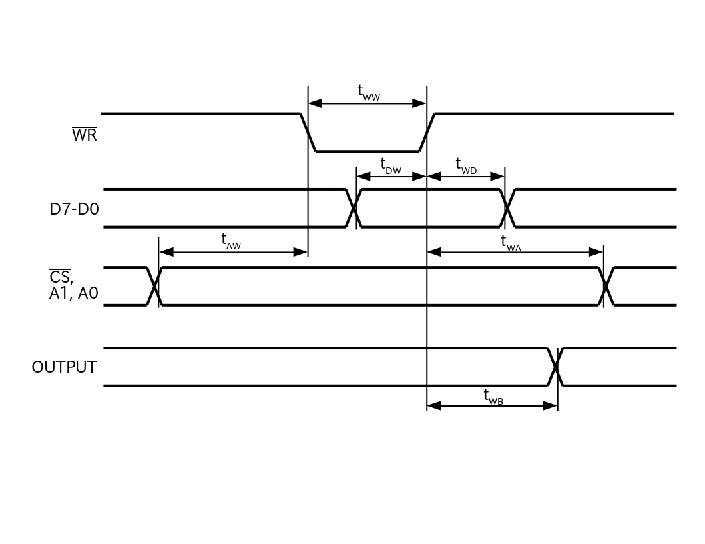

# 8255A-5

## 注意
このドキュメントは英語が苦手な私が、拙速に参照するために作成したものです。基本的には原本(英語)を見ながら使用します。

変な表現や間違った訳が存在しており、いくつかは認識しています。基本的に修正する予定はありません。

8255を設計する方は、ほとんどの場合はオリジナルを参照した方が効率的でしょう。

## 説明
8255Aは多目的でプログラム可能なI/Oデバイスである。24のI/Oピンを持っている。12ピンずつ2グループに別れており3つのモード(MODE0-MODE2)で制御される。

MODE0では、各グループ12のI/Oピンを4ピン毎で入出力する。

MODE1では、各グループの内8つの入出力の設定する。残ったピンはハンドシェイクや割り込み制御信号として使用される。

MODE2では、双方向バスモードとして8ピンを使用する。また、残りのピンと他のグループからの1ピンを合わせた5ピンをハンドジェイクとして使用する。

Figure 1. 8255A Block Diagram

Figure 2. Pin Configuration

## 概要
8255Aはマイクロプロセッサシステムで使用するために設計された、プログラマブル・ペリフェラル・インターフェース(PPI)デバイスである。

その機能は、マイクロプロセッサシステムのバスからアクセスされる多目的なIOインターフェース装置である。

8255の機能設定は、システムソフトウェアによって行われる。そのため外部ロジックが必要になることはは通常はない。

## Data Bus Buffer
8ビットの3ステート双方向バッファは、8255Aとシステムバスを通信するためにに使われる。
データはCPUからの入出力命令の実行によって送受信される。
制御データ(Control Words)と状態情報(status information)もまた、データバスバッファから転送される。

## Read/Write and Control Logic
このブロックの機能は、制御または情報データ(Control or Status words)の内外両方の転送データをすべて管理することである。

ブロックは、CPUアドレスと制御バスからの入力を受け入れ、次に
両方の制御グループにコマンドを発行する。

### (/CS)
Chip Select。このピン入力を"LOW"にすると、8255AとCPUとの通信を有効にする。

### (/RD)
Read。このピン入力を"LOW"にすると、データバスを通じてCPUにデータまたは状態情報(status information)を送信することが有効となる。
言い換えると、CPUが8255A"から読み取る"ことを許可する。

### (/WR)
Write。このピン入力を"LOW"にすると、CPUはデータまたは制御データ(Control words)を8255Aへ書き込むことを有効にする。

### (A0 and A1)
Port Select 0 and Port Select 1。/RDと/WRとの信号と連携したこれらの信号は、ポートの制御や制御レジスタの制御する。通常これらのポートには、アドレスバスの再開ビット(A0とA1)が接続される。

#### 8255A BASIC Operation
|A1|A0|/RD|/WR|/CS|Input Operation(READ)|
|:-|--|---|---|---|---------------------|
|0 |0 |0  |1  |0  |Port A -> Data Bus   |
|0 |1 |0  |1  |0  |Port B -> Data Bus   |
|1 |0 |0  |1  |0  |Port C -> Data Bus   |

|A1|A0|/RD|/WR|/CS|Output Operation(WRITE)|
|:-|--|---|---|---|-----------------------|
|0 |0 |1  |0  |0  |Data Bus -> Port A     |
|0 |1 |1  |0  |0  |Data Bus -> Port B     |
|1 |0 |1  |0  |0  |Data Bus -> Port C     |
|1 |1 |1  |0  |0  |Data Bus -> Contorl    |

|A1|A0|/RD|/WR|/CS|Disable Function      |
|:-|--|---|---|---|----------------------|
|X |X |X  |X  |1  |Data Bus -> 3-State   |
|1 |1 |0  |1  |0  |Illegal COndition     |
|X |X |1  |1  |0  |Data Bus -> 3-State   |

### (RESET)
Reset。このピン入力を"HIGH"にすると、制御レジスタがクリアされ、すべてのポート(A, B, C)が入力モードに切り替わる。

## Group A and Group B Control
各ポートはシステムソフトウェアによって制御される。言い換えると、CPUは制御データ(Control Words)を8255Aへ"出力する"。

制御データには(Control Words)8255Aの機能を初期化する　"mode", "bit set", "bit reset", …等の情報が含まれる。

各制御ブロック(グループAとグループB)は、Read/Write Control Logicからの「コマンド」を受け入れ、内部データバスから"制御データ(Control Words)"を受信し、関連するポートに適切なコマンドを発行する。

- Control Group A - Port A and Port C upper (C7-C4)
- Control Group B - Port A and Port C lower (C3-C0)

制御データレジスタ(Control Word Register)は書き込みのみ可能。このレジスタへの読み取りは許可しない。

## Ports A, B, and C
8255Aには3つの8ビットポート(A, B, and C)がある。すべてシステムソフトウェアによって幅に広い設定をすることができる。
ただ、それぞれは8255Aをさらに強化する特別な機能または"個性"を持っている。

Port A. 8ビットデータの出力ラッチとバッファ。そして8ビットデータの入力ラッチ。

Port B. 8ビットデータの入出力ラッチとバッファ。そして8ビットデータの入力バッファ。

Port C. 8ビットデータの出力ラッチとバッファ。そして8ビットデータの入力バッファ(ラッチ入力ではない)。このポートはモード制御(mode contol)によって4ビットずつ2つに分割することができる。各4ビットポートは4ビットのラッチを含み、ポートA,Bと連携して制御信号の出力や、状態信号の入力として使用することができる。

|Pin name|                |
|:-------|----------------|
|D7-D0   |データバス      |
|RESET   |リセット入力    |
|/CS     |チップセレクト  |
|/RD     |読取信号        |
|/WR     |書込信号        |
|A0, A1  |ポートアドレス  |
|PA7-PA0 |ポートA (ビット)|
|PB7-PB0 |ポートB (ビット)|
|PC7-PC0 |ポートC (ビット)|
|VCC     |+5ボルト電源    |
|GND     |0ボルトグランド |

## 8255動作説明
### モード設定
3つの基本的なモードをシステムソフトウェアから選択する：

- Mode0 - 基本的なI/O
- Mode1 - 瞬間的(Strobed)なI/O
- Mode2 - 双方向バス

リセット入力に"HIGH"を入力したとき、すべてのポートは入力となる(つまり、24ピンすべてがハイインピーダンス状態となる)。
リセットを解除した後は入力を維持でき、追加の初期化処理をする必要はない。
システムプログラムの実行中に一つの出力命令で他のモードを選択できる。
これにより、一つの8255Aが簡単なソフトウェア処理で様々な周辺デバイスの制御をすることができる。

モードはポートAとポートBに分けて定義している。一方ポートCについては2つに分割され必要に応じてポートAとポートBのモードに定義される。
ステータスフリップフロップを含むすべての出力レジスタはモードが変化したときにいつでもリセットされる。
モードを組み合わせて機能を定義することで、ほとんどのI/O構造に"仕立てる"ことができる。
例えば、グループBはモード0に設定することでスイッチの入力状態のモニターやコンピュータの計算結果の取得をすることができる。
グループBはモード1に設定することで、割り込み入力を利用したキーボード入力のモニターやテープの読取りをすることができる。

Figure 5. Basic Mode Definitions and Bus Interface

Figure 6. Mode Definition Format

### 1ビットのセット/リセット機能
ポートCの8ビットの内、いずれかのビットをセットまたはリセットしたい場合にはシングル出力命令を使用する。この機能により、ソフトウェアアプリケーションの負担を軽減することができる。

ポートA,BによってポートCがステータス/コントロール信号して使用する場合、それらのビットはセット/リセット命令を使用することによって出力ポートのようにビットを設定できる。

Figure 7. Bit Set/Reset Format

### 割り込み制御機能
8255Aをモード1,2に設定したとき、制御信号はCPUへの割り込み入力として使用される。割り込み要求信号はポートCより出力される。有効/無効化の設定はポートCのビットのセット/リセット機能を利用したINTEフリップフロップによって行われる。

この機能は、他のデバイスへ影響を与えることなく特定のI/OデバイスによるCPUへの割り込みを禁止または許可にできる。

INTEフリップフロップの定義:
- (BITSET)-INTE set-Interrupt enable
- (BIT-RESET)-INTE is RESET-Interrupt disable

#### NOTE:
すべてのマスクされたフリップフロップは、モード選択を変更したとき、またはデバイスリセットが発生したときにリセットされる。

### 制御モード
#### MODE 0 (基本的なI/O)
この機能は、各3角ポートにシンプルな入出力制御を提供する。
"ハンドシェイク"を要求せずに簡単に指定されたポートを読み書きできる。

MODE 0の基本的な機能：
- ２つの8ビットポートと2つの4ビットポート
- どのポートも入出力にできる。
- ラッチ出力
- 非ラッチ入力
- 16種類の異なる入出力設定が可能

MODE 0 (BASIC INPUT)

MODE 0 (BASIC OUTPUT)

MODE 0 PORT DEFINITION

|A |  |B |  |Group A|              |  |Group B|              |
|:-|--|--|--|-------|--------------|--|-------|--------------|
|D4|D3|D1|D0|Port A |Port C (Upper)|# |Port B |Port C (Lower)|
|0 |0 |0 |0 |OUTPUT |OUTPUT        |0 |OUTPUT |OUTPUT        |
|0 |0 |0 |1 |OUTPUT |OUTPUT        |1 |OUTPUT |INPUT         |
|0 |0 |1 |0 |OUTPUT |OUTPUT        |2 |INPUT  |OUTPUT        |
|0 |0 |1 |1 |OUTPUT |OUTPUT        |3 |INPUT  |INPUT         |
|0 |1 |0 |0 |OUTPUT |INPUT         |4 |OUTPUT |OUTPUT        |
|0 |1 |0 |1 |OUTPUT |INPUT         |5 |OUTPUT |INPUT         |
|0 |1 |1 |0 |OUTPUT |INPUT         |6 |INPUT  |OUTPUT        |
|0 |1 |1 |1 |OUTPUT |INPUT         |7 |INPUT  |INPUT         |
|1 |0 |0 |0 |INPUT  |OUTPUT        |8 |OUTPUT |OUTPUT        |
|1 |0 |0 |1 |INPUT  |OUTPUT        |9 |OUTPUT |INPUT         |
|1 |0 |1 |0 |INPUT  |OUTPUT        |10|INPUT  |OUTPUT        |
|1 |0 |1 |1 |INPUT  |OUTPUT        |11|INPUT  |INPUT         |
|1 |1 |0 |0 |INPUT  |INPUT         |12|OUTPUT |OUTPUT        |
|1 |1 |0 |1 |INPUT  |INPUT         |13|OUTPUT |INPUT         |
|1 |1 |1 |0 |INPUT  |INPUT         |14|INPUT  |OUTPUT        |
|1 |1 |1 |1 |INPUT  |INPUT         |15|INPUT  |INPUT         |

#### MODE 1 瞬間的(Strobed)なI/O
この機能は、"ハンドシェイク"信号やストローブと連携して、指定されたポートとの間でI/Oデータを転送(to or from)する手段を提供する。
MODE 1では、ポートA,BはポートCが生成した"ハンドシェイク"信号を使用する。

MODE 1の基本的な機能：
- 2つのグループ(グループAとグループB)
- 1つのグループには、8ビットのデータポートと4ビットの制御/データポートを含む
- 8ビットのデータポートは入出力どちらかにできる。入出力どちらの場合もラッチ付きとなる。
- 4ビットのポートは8ビットデータポートの制御/状態用として使用する。

##### 入力制御信号の説明
###### /STB (Strobe Input)
このポートに"LOW"入力すると、入力データがラッチされる。

###### IBF (Input Buffer Full F/F)
このポートが"HIGH"出力をしているときは、すでに入力データが読み取られ、ラッチされていることを示す。
要するにアクノリッジ信号のことである。
IBFはSTB信号がLOWになったときにセットされ、RD信号の立ち上がりで入力でリセットされる。

###### INTR (Interrupt Request)
このポートが"HIGH"を出力しているときは、入力デバイスがサービスを要求している場合である。
INTRは/STBが"1"、IBFが"1"、そしてINTEが"1"のときにセットされ、RD信号の立ち下がりで入力でリセットされる。
この手順により、簡単なストローブデータ入力でCPUにサービス要求ができる。

Figure 8. MODE 1 Input

Figure 9. MODE 1 (Strobed Input)

##### 出力制御信号の説明
###### /OBF (Output Buffer Full F/F)
/OBFが"LOW"出力をするのは、CPUが出力データを指定のポートに書き込んだときである。
/OBFのフリップフロップは、/WR信号が立ち上がったときにセットされ、/ACK入力が"LOW"となったときにリセットされる。

###### /ACK (Acknowledge Input)
このポートに"LOW"を入力すると、8255AにポートAまたはポートBからのデータを受け付けたことを知らせる。要するに外部のデバイスがデータを受け付けたことをデータを出力したCPUに知らせるレスポンスである。

###### INTR (Interrupt Request)
CPUからの送信データをデバイスが受け付けたときには、このポートは"HIGH"を出力しCPUへ割り込みをかけることができる。
INTRは/ACKが"1",/OBFが"1"、そしてINTEが"1"のときにセットされ、/WR信号の立ち下がりで入力でリセットされる。

###### INTE A
PC6のビットセット/リセット制御を行う。

###### INTE B
PC2のビットセット/リセット制御を行う。

Figure 10. MODE 1 Output

Figure 11. MODE 1 (Strobed Output)

##### MODE 1 の組み合わせモード
ポートAとポートBそれぞれ入出力の異なるモード1に設定することで、様々な種類のI/Oアプリケーションをサポートできる。

Figure 12. Combinations of MODE 1

#### MODE 2 双方向バス
この機能は、8ビット双方向バスの送受信によって周辺デバイスとの通信を行う手段を提供する。
"ハンドシェイク"信号は、MODE1と似たバス調停を提供する。
割り込み出力の有効/無効機能が利用できる。

MODE 2の基本的な機能：
- 使用するのはグループAのみ
- ポートAの8ビット分を双方向ポートとして使用する。ポートCの5ビット分は制御信号として使用する。
- 入出力どちらもラッチされる。
- 5ビット分の制御信号は、8ビットの双方向バスの制御及び状態出力として使用する。

##### 双方子入出力バス制御信号の説明
###### INTR (Interrupt Request)
このポートのHIGH出力は、CPUの入出力割り込み制御として使用できる。

##### 出力制御
###### /OBF (Output Buffer Full)
/OBFの"LOW"出力は、CPUがポートAへデータを書き込んだことを示す。

###### /ACK (Acknowledge)
/ACKへの"LOW"入力は、ポートAを出力としデータ送信を行うことを示す。
そうでない場合は、ポートAはハイインピーダンス状態となる。

###### INTE 1 (The INTE Flip-Flop Associated with OBF)
PC6のビット操作によってセット/リセットされる。

##### 入力制御
###### /STB (Strobe Input)
このポートへの"LOW"入力で、入力データのラッチを行う。

###### IBF (Input Buffer Full F/F)
このポートへの"HIGH"出力は、入力データをラッチへ通すことを示す。

###### INTE 2 (The INTE Flip-Dlop Associated with IBF)
PC4のビット操作によってセット/リセットされる。

Figure 13. MODE Control Word

Figure 14. MODE 2

Figure 15. MODE 2(Bidirectional)

Mode設定のまとめ

|   |MODE0|     |MODE1|     |MODE2|
|:-:|:---:|:---:|:---:|:---:|:---:|
|   |IN   |OUT  |IN   |OUT  |IN   |
|PA0|IN   |OUT  |IN   |OUT  |<--->|
|PA1|IN   |OUT  |IN   |OUT  |<--->|
|PA2|IN   |OUT  |IN   |OUT  |<--->|
|PA3|IN   |OUT  |IN   |OUT  |<--->|
|PA4|IN   |OUT  |IN   |OUT  |<--->|
|PA5|IN   |OUT  |IN   |OUT  |<--->|
|PA6|IN   |OUT  |IN   |OUT  |<--->|
|PA7|IN   |OUT  |IN   |OUT  |<--->|
|||||||
|PB0|IN   |OUT  |IN   |OUT  |-    |
|PB1|IN   |OUT  |IN   |OUT  |-    |
|PB2|IN   |OUT  |IN   |OUT  |-    |
|PB3|IN   |OUT  |IN   |OUT  |-    |
|PB4|IN   |OUT  |IN   |OUT  |-    |
|PB5|IN   |OUT  |IN   |OUT  |-    |
|PB6|IN   |OUT  |IN   |OUT  |-    |
|PB7|IN   |OUT  |IN   |OUT  |-    |
|||||||
|PC0|IN   |OUT  |INTRB|INTRB|I/O  |
|PC1|IN   |OUT  |IBFB |/OBFB|I/O  |
|PC2|IN   |OUT  |/STBB|/ACKB|I/O  |
|PC3|IN   |OUT  |INTRA|INTRA|INTRA|
|PC4|IN   |OUT  |/STBA|I/O  |/STBA|
|PC5|IN   |OUT  |IBFA |I/O  |IBFA |
|PC6|IN   |OUT  |I/O  |/ACKA|/ACKA|
|PC7|IN   |OUT  |I/O  |/OBFA|/OBFA|
