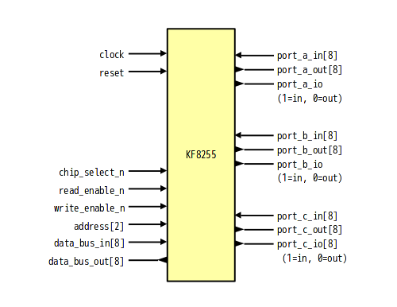

# KF8255 - 8255-like programmable peripheral interface written in SystemVerilog

## About
KF8255 is programmable peripheral interface like 8255/8255A.

## Differences from original
- Clock synchronization
- I/O ports is separated into input and output port

## Features
- 3 I/O (Port A, PortB, Port C)
- Mode 0: Basic Input/Output
- Mode 1: Storobed Input/Output
- Mode 2: Bi-Directional Bus

## Block

