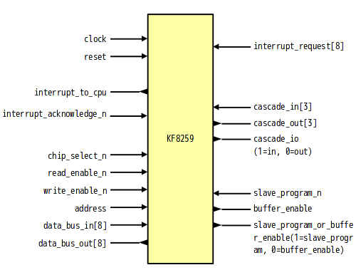

# KF8259 - 8259/8259A-like Interrupt Controller written in SystemVerilog

## About
KF8259 is programmable interrupt controller like 8259/8259A.

## Differences from original
- Clock synchronization
- I/O ports is separated into input and output port

## Features
- MCS-80/85 Mode / 8086 Mode
- Fully Nested Mode
- End of Interrupt
- Automatic End of Interrupt(AEOI) Mode
- Automatic Rotation
- Specific Rotation
- Interrupt Masks
- Special Mask Mode
- Poll Command
- Reading the 8259A Status
- Edge and Level Triggered Modes
- Buffered Mode
- Cascade Mode

## Block

