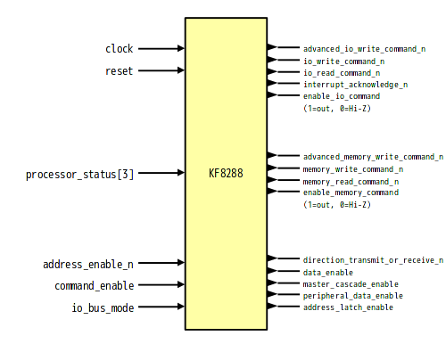

# KF8288 - 8288-like bus controller written in SystemVerilog

## About
KF8288 is bus controller like 8288.

## Differences from original
- Clock synchronization
- I/O ports is separated into input and output port

## Features
- I/O Bus Mode / System Bus Mode
- Memory Read Command (nMRDC)
- Memory Write Command (nMWTC)
- I/O Read Command (nIORC)
- I/O Write Command (nIOWC)
- Advanced Memory Write Command (nAMWC)
- Advanced I/O Write Command (nAIOWC)
- Interrupt Acknowledge (nINTA)

## Block

