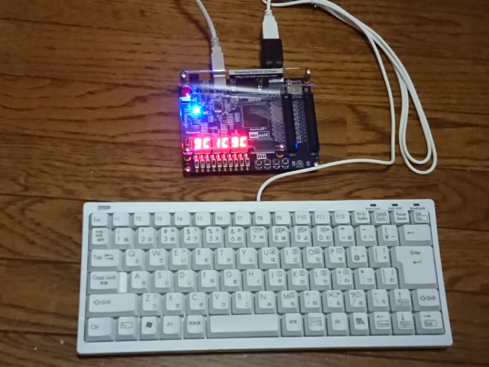
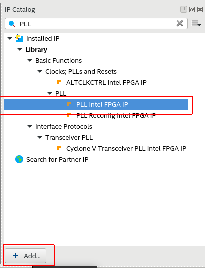
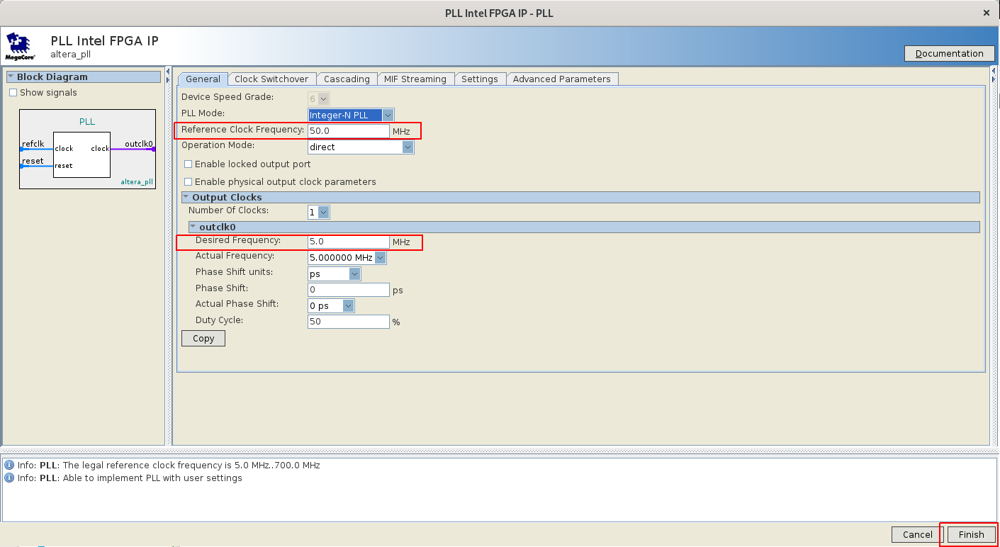
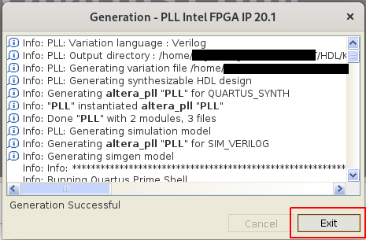
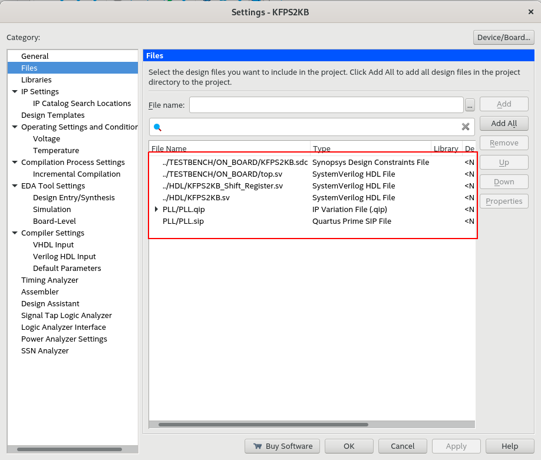
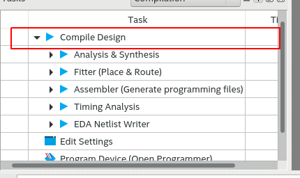
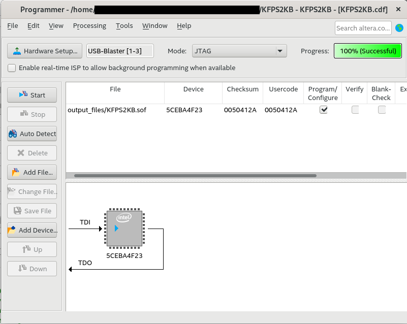

# How to install KFPS2KB-DEMO on DE0-CV

## 1. Install Quartus Prime

## 2. Create project
"File" -> "New Project Wizerd" -> Follow the wizerd...

## 3. Create PLL
"IP Catalog" -> "PLL Intel FPGA IO"

Reference Clock Frequency : 50MHz

Enable locked output port : disable

Desired Frequency : 5MHz

-> "Finish"

-> "Exit"

## 4. Add files
"Project" -> "Add/Remove Files to Project"

Add top.sv, KFPS2KB.sv and KFPS2KB_Shift_Register.sv

## 5. Compile
"Compile Design"

## 6. Pin assignments
"Assignments" -> "Pin Planner"

|Name   |I/O   |Pin     |
|:------|------|--------|
|CLK    |Input |PIN_M9  |
|HEX0[6]|Output|PIN_AA22|
|HEX0[5]|Output|PIN_Y21 |
|HEX0[4]|Output|PIN_Y22 |
|HEX0[3]|Output|PIN_W21 |
|HEX0[2]|Output|PIN_W22 |
|HEX0[1]|Output|PIN_V21 |
|HEX0[0]|Output|PIN_U21 |
|HEX1[6]|Output|PIN_U22 |
|HEX1[5]|Output|PIN_AA17|
|HEX1[4]|Output|PIN_AB18|
|HEX1[3]|Output|PIN_AA18|
|HEX1[2]|Output|PIN_AA19|
|HEX1[1]|Output|PIN_AB20|
|HEX1[0]|Output|PIN_AA20|
|HEX2[6]|Output|PIN_AB21|
|HEX2[5]|Output|PIN_AB22|
|HEX2[4]|Output|PIN_V14 |
|HEX2[3]|Output|PIN_Y14 |
|HEX2[2]|Output|PIN_AA10|
|HEX2[1]|Output|PIN_AB17|
|HEX2[0]|Output|PIN_Y19 |
|HEX3[6]|Output|PIN_V19 |
|HEX3[5]|Output|PIN_V18 |
|HEX3[4]|Output|PIN_U17 |
|HEX3[3]|Output|PIN_V16 |
|HEX3[2]|Output|PIN_Y17 |
|HEX3[1]|Output|PIN_W16 |
|HEX3[0]|Output|PIN_Y16 |
|HEX4[6]|Output|PIN_P9  |
|HEX4[5]|Output|PIN_Y15 |
|HEX4[4]|Output|PIN_U15 |
|HEX4[3]|Output|PIN_U16 |
|HEX4[2]|Output|PIN_V20 |
|HEX4[1]|Output|PIN_Y20 |
|HEX4[0]|Output|PIN_U20 |
|HEX5[6]|Output|PIN_W19 |
|HEX5[5]|Output|PIN_C2  |
|HEX5[4]|Output|PIN_C1  |
|HEX5[3]|Output|PIN_P14 |
|HEX5[2]|Output|PIN_T14 |
|HEX5[1]|Output|PIN_M8  |
|HEX5[0]|Output|PIN_N9  |
|PS2_CLK|Input |PIN_D3  |
|PS2_DAT|Input |PIN_G2  |

"Processing" -> "Start I/O Assignment Analysis"

## 7. Compile

## 8. Configuration (sof file)
"Tool" -> "Programmer"

"Hardware Setup" -> "Start"

## 9. Run

