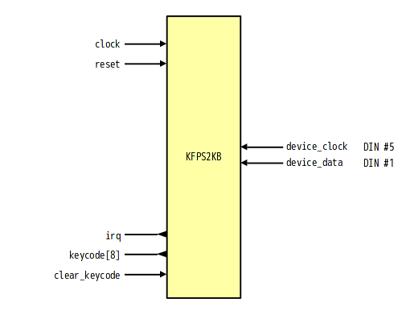

# KFPS2KB - Simple PS/2 keyboard controller

## About
KFPS2KB is simple PS/2 keybord contoroller.

This module support input from keybord only.

|port         |I/O|connect(exampe)|
|:------------|---|---------------|
|clock        |I  |CLK            |
|reset        |I  |RESET          |
|device_clock |I  |DIN #5         |
|device_data  |I  |DIN #1         |
|irq          |O  |8259 IRQ1      |
|key_code[7:0]|O  |8255 PA0-7     |
|clear_keycode|I  |8255 PB7       |

## Features
- Connect to PS/2 Keybord
- Detect Make/Break keycode

## Block

